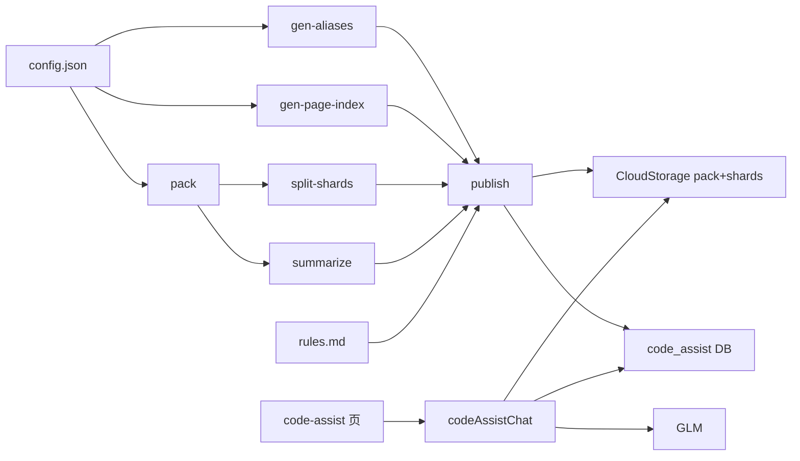

# 小黑（code-assist）开发说明

主人专用代码排查助手：本机索引业务仓，小程序只对话。

本目录集中**本机工具链**（配置、脚本、产物）。小程序运行时在 [`src/code-assist/`](../src/code-assist/)，云函数仍在 `cloudfunctions/codeAssistChat`、`cloudfunctions/speechToText`。

## 目录

```text
code-assist/
  config.json          # 项目列表、openid、envId
  rules.md             # 排查规范（publish 入库）
  scripts/             # pack / publish 等
  out/<slug>/          # 本机产物（gitignore）

src/code-assist/       # 小程序 API / 组件 / 工具
src/pages/code-assist/ # 对话页
```

## 端到端



| 步骤 | 命令 | 产物 |
|------|------|------|
| 别名 | `npm run code-assist:aliases` | `out/.../xiaohei-aliases.json` |
| 模块索引 | `npm run code-assist:page-index` | `out/.../xiaohei-page-index.json` |
| 打包 | `npm run code-assist:pack` | `out/.../xiaohei-pack.json` |
| 切片 | `npm run code-assist:shards` | manifest + shards |
| 简报 | `npm run code-assist:summarize` | `xiaohei-brief.json` |
| 发布 | `npm run code-assist:publish` | 上传 pack/shards/manifest + 写库 |

`publish` 顺序：aliases → pageIndex → pack → shards → summarize → 上传。  
常用：本机 local 脚本或 `npm run code-assist:publish -- --project <slug>`（可加 `--reuse-brief`）。

环境变量：`ZHIPU_API_KEY`、`TCB_SECRET_ID`、`TCB_SECRET_KEY`（`envId` 可写在 config）。

## 多项目

配置见 [`config.json`](./config.json)：`defaultSlug` + `projects[]`（`slug` / `name` / `source` / `projectId`）。

```bash
# 按 slug 发布（产物在 code-assist/out/<slug>/）
npm run code-assist:publish -- --project mobile-bank-uniapp
npm run code-assist:publish -- --project mobile-bank --reuse-brief
npm run code-assist:publish -- --project inner-manage
```

- 首次 publish 会生成并写回该项目的 `projectId`
- 小程序顶栏切换项目；选中项写入云库 `kind: prefs`（**不用本地缓存**）
- 对话 `kind: chat` 按 `projectId` 隔离
- 非 uni 仓可能没有 `pages.json`，索引会偏空，但对话仍可用

扩展新项目：在 `projects` 追加一项 → publish → 刷新小程序。

### 多源合并项目（如「手机银行（全）」）

单条 `projects` 配置可用 `sources` 代替 `source`，把多个业务仓合并为一个 projectId：

```json
{
  "slug": "mobile-bank-full",
  "name": "手机银行（全）",
  "sources": [
    { "key": "uniapp", "label": "新架构", "path": "/path/to/mobile-bank-uniapp" },
    { "key": "legacy", "label": "旧架构", "path": "/path/to/mobile-bank" }
  ]
}
```

- pack / pageIndex / aliases 路径统一加 `{key}/` 前缀（如 `uniapp/src/ghb_deposit/...`）
- 索引 `root` 为 `uniapp/ghb_deposit`，引用@ 插入 `@uniapp/ghb_deposit`
- 与单仓项目并存，互不影响

## 云库 `code_assist`（`kind`）

| kind | 内容 | 聊天是否使用 |
|------|------|----------------|
| project | 状态、bundleFileID、manifestFileID、packMode、slug、openid | 是 |
| summary | 简报、目录树、manifestFileID | 是 |
| rules | `rules.md` | 是（注入【排查规范】） |
| aliases | pages.json 生成的中英对照 | 是（检索打分） |
| pageIndex | 模块/页面索引（path、title、file；策略 A/B/C） | 否（小程序索引 UI；点页面看源码） |
| chat | 按 projectId 存的对话历史 | 是（进出页恢复） |
| prefs | 当前选中的 selectedProjectId | 是（跨设备记住选中项目） |

## 文件索引（@ 模块限定 + 看代码）

publish 生成 `kind: pageIndex`（含 `pages[]`：path / title / file），策略按序择优：

| 策略 | 适用 | 做法 |
|------|------|------|
| A | 分模块 pages.json（如 mobile-bank-uniapp） | 扫 `src/**/pages.json` 且带 `root` |
| B | 根 pages.json + subPackages（如 wxbank、mgm） | 读 `src/pages.json`，主包 + 分包 |
| C | Vue 路由仓 / 无 pages.json（mobile-bank、NPB、H5share、内管） | 扫 `src/modules`、`src/views`、`src/pages` 下 `.vue` |

`file` 一律为相对业务仓根的路径，小程序点页面 → `getFile` 看源码；「引用@」仍追加 `@root`。

- 云函数 `extractAtRoots`：有 `@` 时检索限定在该模块路径/shard，匹配 +120 分
- 寒暄（如「你好」）：`isChitchat` 早退，不下载 pack/shards、不选文件

## Pack 切片与按需下载

整包约十几 MB。发布时额外上传：

- **manifest**（路径 → shard，无正文，约数百 KB）
- **shards**（按 `modulePrefix` 切分，如 `src/ghb_deposit`）

对话时若有 `manifestFileID`：

1. 下载 manifest  
2. 路径/别名打分选出约 ≤12 个 shard 下载（实例内按 fileID 缓存）  
3. 正文打分 + import 跟随；缺模块再补下 1～2 轮  
4. 失败则回退全量 `bundleFileID`

无 manifest 的老项目仍走全量 pack。

## 对话检索（codeAssistChat）

1. 鉴权、拉 project/summary/rules/aliases、按需/全量源码  
2. `pickPaths`：点名 → 全局打分 → import 跟随 → 模块邻居  
3. `buildSourceBlock`：按分灌入；`usedFiles` = 真正写入 prompt 的路径  
4. system = 规范 + 简报 + 树 + 源码 → 单次 GLM  

云函数配置约 60s / 1024MB；改完后重新上传 **codeAssistChat**（路径：`cloudfunctions/codeAssistChat`）。

## 别名表

脚本扫 `{source}/src/**/pages.json`：`zh` = name + 标题；`en` = root / token。  
业务改 pages 后重新 publish 即可。

## Rules

见 [`rules.md`](./rules.md)。publish 入库；聊天注入（约 8k 字截断）。

## 前端

[`src/pages/code-assist/index.vue`](../src/pages/code-assist/index.vue)：主人校验、顶栏项目切换、发消息、复制、AI 截图；底部「已读·开/关」；输入框上方狗头打开文件索引，选中填入 `@root`；助手气泡原生表格 + rich-text；左侧麦克风切换「按住说话」（腾讯云 ASR）。  
运行时代码在 [`src/code-assist/`](../src/code-assist/)。

## 语音转文字（speechToText）

按住说话 → 录音 mp3 → 云函数 `speechToText` → **腾讯云一句话识别**（非智谱 ASR）。

| 项 | 说明 |
|----|------|
| 云函数 | `cloudfunctions/speechToText`，超时 20s |
| 环境变量 | `TCB_SECRET_ID`、`TCB_SECRET_KEY`（云开发 → 环境设置 → API 密钥，与 publish 相同） |
| 控制台 | [语音识别](https://console.cloud.tencent.com/asr) 开通「一句话识别」；新用户默认关闭后付费，**每月 5000 次免费** |
| 部署 | 改云函数后：开发者工具 → 上传并部署 `speechToText` |

对话仍用 `ZHIPU_API_KEY`（`codeAssistChat`），与语音识别密钥无关。

## 仍可优化

- 单轮检索读偏时可考虑第二轮扩选  
- 截图长文截断  
- publish 上传 shard 较多时较慢（一次性成本）
- 非 pages.json 仓的 aliases 策略（检索打分仍可加强）

## 日常检查清单

1. 改 Rules / pages / 源码后：`npm run code-assist:publish -- --project <slug>`  
2. 改云函数逻辑后：重新部署 `codeAssistChat`；改语音识别后部署 `speechToText`  
3. 小程序打开「小黑」，顶栏切换项目后提问验收
